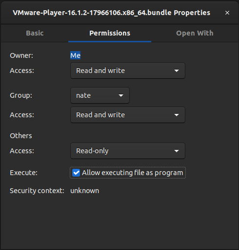

<center><h1>How to install VM & setup Single Pass through GPU</h1></center>
<center><p>(Ubuntu 20.04 Host/Windows 10 VM)</p></center>

1. Launch Terminal and run

> ```console
> sudo apt install build-essential
> ```

<br />

2. Download VMware Workstation (Linux)

<center><a href="https://www.vmware.com/products/workstation-player.html"></a></center>

<br />

3. Go to where the bundle was installed to (likely Downloads folder), and right click the bundle. Then select "Properties", then move tot eh "Permissions" and check the box under "Execute" that displays "Allow executing file as program"

<center></center>

<br />

4. You can now run these command against the download

> i.
>
> ```console
> chmod +x ~/Downloads/VMware-Player*
> ```

> ii.
>
> ```console
> sudo ~/Downloads/VMware-Player*
> ```

5. You can now run through the setup wizard, you do not need a license if you did not purchase one.

6. Open VM Ware Player "Create a New Virtual Machine" & select "I will install the operating system later"

7. Select Guest OS as Windows & desired settings (Don't sweat the configuration too much, you can always re-adjust a VMs settings)

8. Open your VMWare player and start the VM yus should see the boot sequence showing

   > ```
   > Attempting to start up from:
   > -> EFI VMWare Virtual SCSI Hard Drive (0.0)...
   > No Media -> EFI VMWare Virtual SATA CDROM Drive (1.0)...
   > No Media -> EFI Network...
   > ```

9. Use key combination "Ctrl + Alt" to release your input from the VM, at the top of the window select "Virtual Machine" => "Removeable Devices" (You should see the boot usb) => {BOOT USB} => "Connect (Disconnect from host)"

10. At that point the USB is then exposed to the VM, now using the key combination "Ctrl + Alt + Delete" to restart the VM boot sequence. Wait for the screen displaying the message.

> ```
> Attempting to start up from:
> -> EFI VMWare Virtual SCSI Hard Drive (0.0)...
> No Media -> EFI VMWare Virtual SATA CDROM Drive (1.0)...
> No Media -> EFI Network...
> ```

11. Be patient, it may take a while for the VM to see the bootable deviceIf you get the boot config menu (60 seconds timeout), reattempt "Ctrl + Alt + Delete" to restart the VM boot sequence again, and continue to wait.

12. Once the bootable has taken over, follow the Windows installation prompts, I recommend disabling all location, Cortana, etc. since VMs are pretty temporary.

### Congratulations! You now have your own Windows VM!
